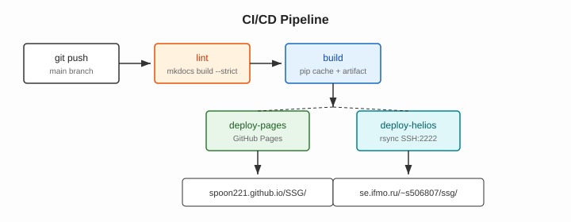

# Static Site Generator Lab

Статический сайт на MkDocs с автоматической публикацией через GitHub Actions на GitHub Pages и Helios ИТМО.

!!! info "Авторы"
    - **Преображенский Георгий Сергеевич**, ИСУ 333414
    - **Симаков Евгений Сергеевич**, ИСУ 506807

{ align=left width="180" }

Сайт написан в Markdown и собирается MkDocs. После каждого пуша в main GitHub Actions проверяет сборку и выкладывает сайт на GitHub Pages и Helios.

Версии Python и пакетов зафиксированы, поэтому сборка везде даёт одинаковый результат.

## Что реализовано

- **MkDocs + Material** — строгая сборка `--strict`
- **GitHub Actions** — lint → build → deploy
- **GitHub Pages** и **Helios ИТМО** — публикация из `main`
- **GitVerse (P1)** — орфография и ссылки → сборка → деплой на Helios
- **Воспроизводимость и кэш** — зафиксированные версии, кэш pip

## Схема пайплайна

## Стек

| Инструмент | Версия |
|---|---|
| Python | 3.12 |
| MkDocs | 1.6.1 |
| Material for MkDocs | 9.5.47 |

## Формулы

Бинарный поиск работает за $O(\log n)$.

Сортировка слиянием делит массив пополам и сливает половины за линейное время:

$$T(n) = 2\,T\!\left(\frac{n}{2}\right) + O(n) = O(n \log n)$$
